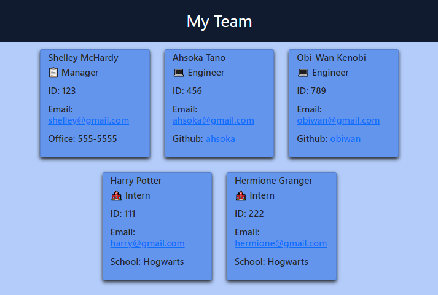

# Team Profile Generator
## Licensing:
#### _MIT License_
## Description
This app allows a user to create an html page containing information about a group of employees. Using the npm package Inquirer, the user is prompted to enter position, id, email, and other information specific to each employee position. That input is then used to create an html page that can be added to and referenced as needed. The project still requires the added functionality of classes and testing.
## Table of Contents
* [Installation](#Installation)
* [Usage](#Usage)
* [Contributors](#Contributors)
* [Testing](#Testing)
* [Questions](#Questions)
## Installation
Download this package and run node install for the dependencies.
## Usage
Use node index.js from the command line to initiate app.

Follow this link to watch a video demonstration of the app: https://youtu.be/o-iPcZrYW1A

## Testing
none at this time
## Questions 
#### To contribute, please contact me by email.

https://github.com/shelleymcq or email me at shelleymcq.dev@gmail.com
